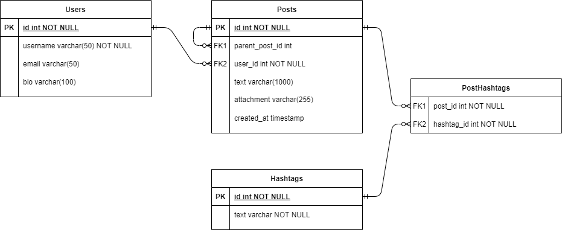

# GigihHub Social Media API

GigihHub is a simple social media to share information with other people in the same community. This repository contains GigihHub APIs, built in Ruby without any frameworks 🤓🚀. This project is intended for learning purposes in Model-View-Controller (MVC) design pattern, practicing Test Driven Development (TDD), and Clean Code.

## Functional Requirements

The Gigih Hub Social Media contains six functional requirements.

- [x] Saves user details (username, email, bio)
- [x] Lets user make a new post with hashtag
- [x] Lets user comment in a post with hashtag
- [ ] Lets user attach media (jpg, png, mp4) in a post or comment
- [x] Lets user get posts with a hashtag
- [x] Shows 5 trending hashtags

## Database Schema

There are four tables created in the database.

1. **User**, represents our social media user which contains user informations.
2. **Post**, represents user's post. A post with `parent_post_id` is a comment to the parent post, meanwhile a parent without `parent_post_id` is the parent post.
3. **PostHashtag**, represents the pivot entity of Post and Hashtag.
3. **Hashtag**, represents hashtag (text initialized with `#`) in a post.

## Prerequisites
1. Ruby v3.0.1
2. MySQL

### Library Dependencies
These libraries are bundled in a `Gemfile`.

1. Sinatra, for simple web server
2. Mysql2, for database connector
3. RSpec, for unit test
4. SimpleCov, for test coverage
5. Rubocop, for code linter, based on Ruby Guide Style

## How to Run
(TBD)
